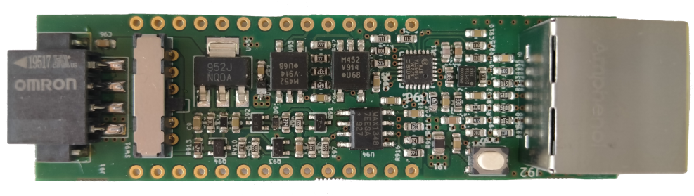
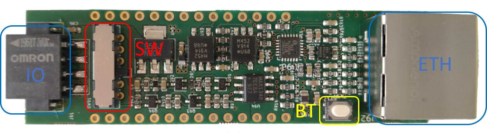

#   IoT-DIO   Digital IO IoT Wireless Adapter

IoT-DIO is a wireless adapter for developing IoT applications for Industrial and Building Automation Systems based on the Espressif chipset ESP32. The adapter is compatible with:
- RS485
- M-Bus
- Ethernet

The library allows the implemention of IoT applications that rely on MQTT protocol via WiFi/NB-IoT/LTE Cat-M1 interfaces.

## Adapter versions
The Iot-DIO wireless adapter is available in two versions developed using [KiCAD 5.1](https://kicad.org/) and compatible with:
- [ESP32-PICO-KIT v4](https://docs.espressif.com/projects/esp-idf/en/latest/esp32/hw-reference/esp32/get-started-pico-kit.html) - is an ESP32-based mini development board produced by [Espressif](https://espressif.com/). The board features integrated Wifi and BLE capabilites.
- [FiPy](https://pycom.io/product/fipy/) - is an ESP32-based mini development board produced by [Pycom](https://pycom.io/). The board features integrated Wifi, BLE, LoRa, Sigfox, NB-IoT and LTE Cat-M1 capabilities.

## Development Framework
IoT-DIO relies on the Espressif IoT Development Framework [ESP-IDF](https://github.com/espressif/esp-idf), the official development framework for the [ESP32](https://espressif.com/en/products/hardware/esp32/overview) chip.

## Configuration

### Pinout
IO pinout (top-down):
- 0: V_BUS
- 1: M-/B-
- 2: M+/A+
- 3: GND

### Functions button
The push button BT performs multiple operations depending on the pressure time Tp.

| Pressure Time   |      Action                                                                      |
|:---------------:|:---------------------------------------------------------------------------------|
|     Tp < 1s     | Performs a soft-reset of the adapter                                             |
|1s < Tp < 5s     | Enables the AP mode. If not previously changed, the device will be visible by default with the SSID `ESP_<MAC>`, where <MAC> is the MAC address of the adapter network interface in hex format|
|5s < Tp          | Performs a hard-reset of the adapter deleting the previously stored configuration|

# Publications

We kindly ask academic publications employing based or inspired to IoT-AIO to cite at least one of the following papers:

- M.H. Schraven, C. Guarnieri Calò Carducci, M.A. Baranski, D. Mueller, A. Monti, “Designing a Development Board for Research on IoT Appli-cations in Building Automation Systems,” 36th International Symposiumon  Automation  and  Robotics  in  Construction  (ISARC  2019),  Banff,Canada, 2019, pp. 82-90, [DOI: 10.22260/ISARC2019/0012](https://doi.org/10.22260/ISARC2019/0012)
- C. Guarnieri Calò Carducci, A. Monti, M. H. Schraven, M. Schumacher and D. Mueller, “Enabling ESP32-based IoT Applications in Building Automation Systems,” 2019 II Workshop on Metrology for Industry 4.0 and IoT (MetroInd4.0&IoT), Naples, Italy, 2019, pp. 306-311, [DOI: 10.1109/METROI4.2019.8792852](https://doi.org/10.1109/METROI4.2019.8792852)

# Copyright

2019-2020, Institute for Automation of Complex Power Systems, EONERC  

# License

 This work is licensed under a <a rel="license" href="http://creativecommons.org/licenses/by/4.0/">Creative Commons Attribution 4.0 International License</a>.

# Contact

- [Carlo Guarnieri Calò Carducci (PhD)](mailto:cguarnieri@eonerc.rwth-aachen.de)

[Institute for Automation of Complex Power Systems (ACS)](http://www.acs.eonerc.rwth-aachen.de)  
[EON Energy Research Center (EONERC)](http://www.eonerc.rwth-aachen.de)  
[RWTH University Aachen, Germany](http://www.rwth-aachen.de)  
